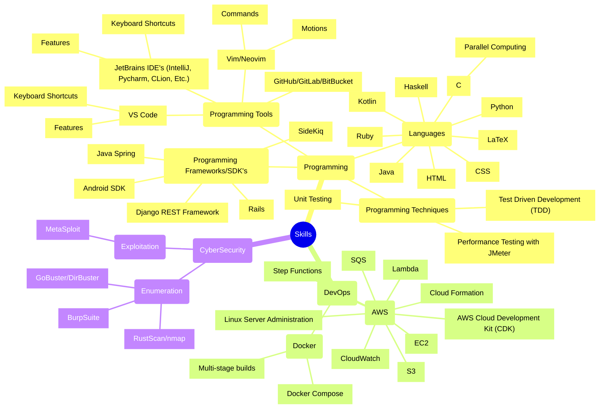
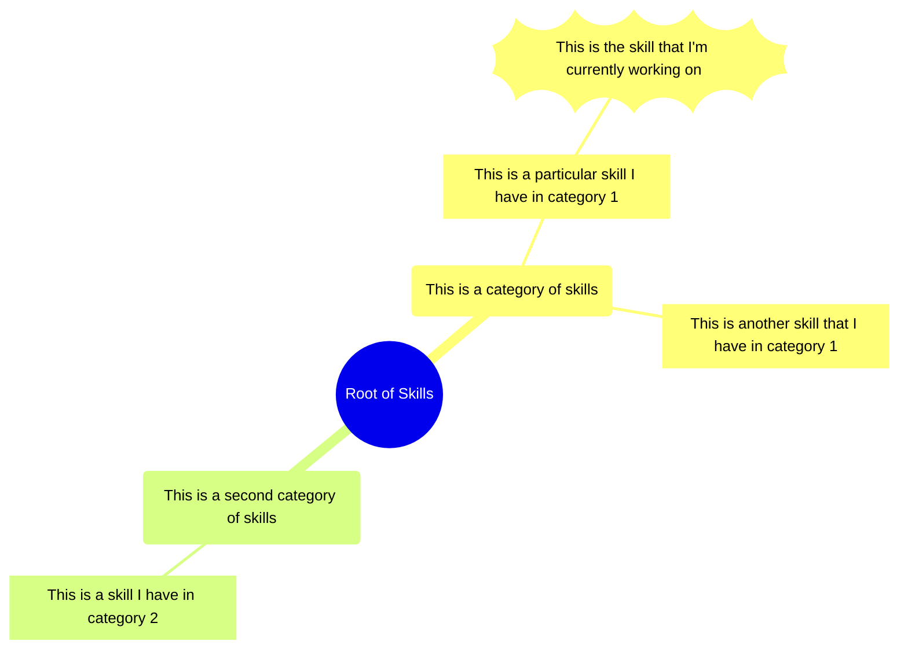

# Skill Tree
## Warning, this is a work in progress, and I haven't had enough time to add all my skills

Below is my current skill tree: 

## About the Skills
Making the claim that I have this or that skill is difficult to quantify.   
I've only included a skill if I would feel comfortable starting a 
new project using that skill and being reasonably efficient immediately. 

## Skill tree Legend

