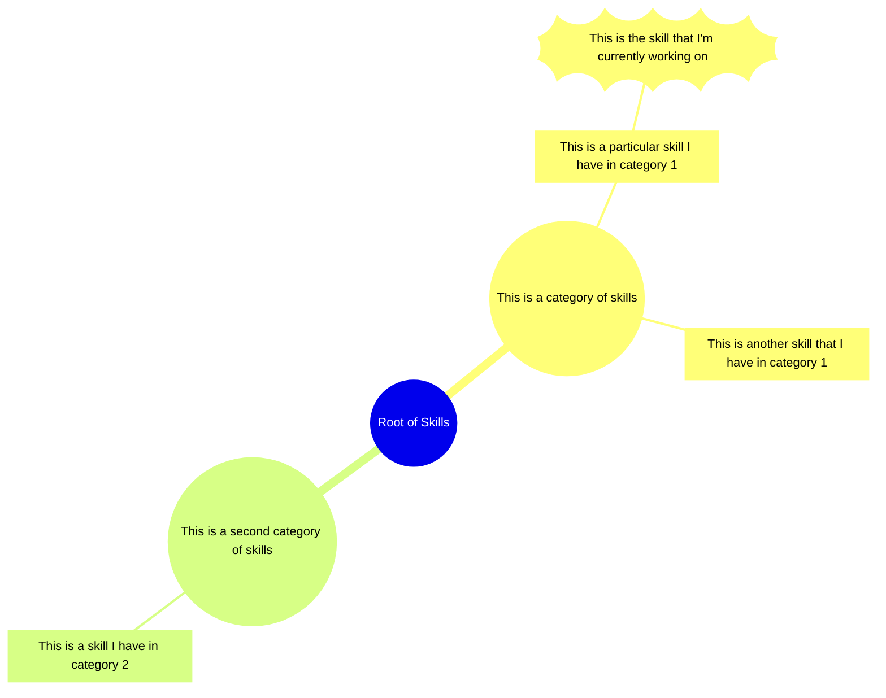
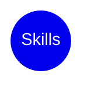

# Skill Tree

Below is the legend of the skill tree

```mermaid
mindmap
    root((Root of Skills))
        category((This is a category of skills))
            skill[This is a particular skill I have in category 1]
                wip))This is the skill that I'm currently working on((
            skill2[This is another skill that I have in category 1]
        category2((This is a second category of skills))
            skill3[This is a skill I have in category 2]
```

Below is my current skill tree: 

```mermaid
mindmap
    root((Skills))
```
