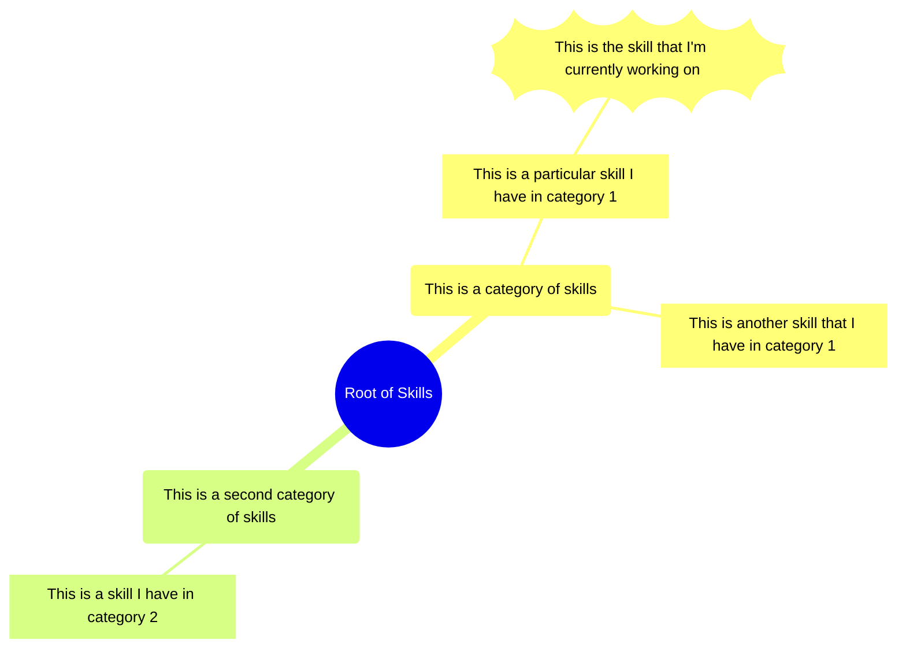

# Skill Tree


Below is the legend of the skill tree



Below is my current skill tree: 


```mermaid
mindmap
    root((Skills))
        languages(Programming Languages)
            [Java]
            [C]
            [Python]
            [Ruby]
            [Haskell]
        frameworks(Programming Frameworks/SDK's)
            [Android SDK]
            [Rails]
            [React]
        devops(DevOps)
            [Docker]
                [Multi-stage builds]
                [Docker Compose]
            [aws]
                [aws Cloud Development Kit (CDK)]
                [S3]
                [Lambda]
                [Cloud Formation]
                [EC2]
                [Linux Server Administration]
        (business)
            [Marketing]
            [Customer Development]

```

